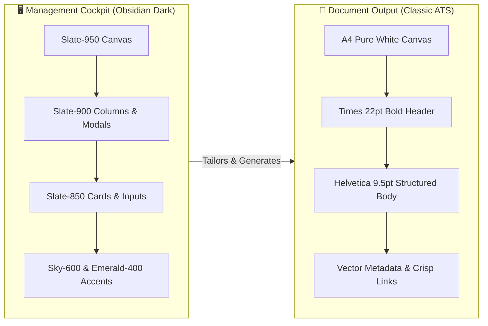
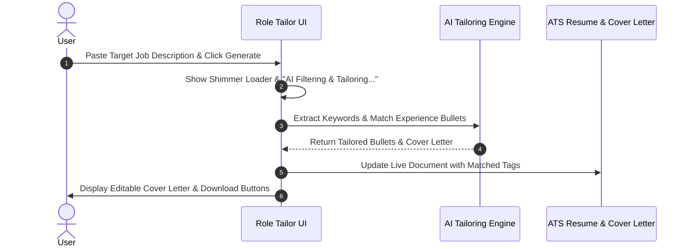

# 📐 Visual Design Guide & System Specifications
**Application:** CV Maker & Role Tracker (Kanban)  
**Design Paradigm:** Obsidian Cyber-Corporate / High-Density Dark Theme & Classic ATS Fidelity  

---

## 1. Visual Direction & Art Direction

The visual identity of this application balances two distinct worlds:
1. **The Management Cockpit (Obsidian Dark UI):** High-contrast, dense, modern slate surfaces built for fast keyboard/mouse workflows, job application tracking, and AI tailoring.
2. **The Output Document (Classic ATS Fidelity):** Pure, distraction-free corporate typography (Times serif header + Helvetica sans-serif body) engineered with pixel-perfect print metrics for Applicant Tracking Systems (ATS) and recruiter scanning.



---

## 2. Color Palette & Spatial Lighting

### 2.1. Surface & Depth Hierarchy
Surfaces are built in layered obsidian tones to create optical depth without distracting textures:

| Layer Level | Tailwind Token | Hex Code | Visual Role |
| :--- | :--- | :--- | :--- |
| **L0: Ground Canvas** | `bg-slate-950` | `#020617` | Base application canvas, window frame background |
| **L1: Structural Shell** | `bg-slate-900` | `#0f172a` | Navbar, Kanban column containers, modal backdrops |
| **L2: Interactive Cards** | `bg-slate-850` | `#172033` | Kanban role cards, preview containers, info boxes |
| **L3: Controls & Inputs** | `bg-slate-800` | `#1e293b` | Form textboxes, dropdown trigger buttons, date pickers |
| **L4: Active / Hover** | `hover:bg-slate-750` | `#273549` | Interactive hover states on dropdowns and buttons |

### 2.2. Intent-Driven Functional Accents
Accents are applied with strict semantic meaning:

```
[ Sky-600 / Sky-500 ] ──────► Primary Actions, Export Buttons, Active Links
[ Emerald-400 ]       ──────► Salary Figures, Successful Matches, Completed Stages
[ Amber-400 / 500 ]   ──────► PRO Feature Badges, Upgrade Alerts, Pending Warnings
[ Rose-600 / Rose-500 ] ────► Permanent Delete, Archive Badges, Destructive Actions
```

---

## 3. Typography Architecture & Spatial Rhythm

### 3.1. Dual Typeface Ecosystem
The application pairs three distinct font families to serve specific roles:

1. **System Sans (`font-sans`):**
   - **Role:** Interface typography, form inputs, button labels, modal copy.
   - **Key Sizes:** `text-base` (16px, Titles), `text-xs` (12px, Standard UI), `text-[11px]` / `text-[10px]` (Micro-metadata).
2. **Engineered Monospace (`font-mono`):**
   - **Role:** Precise numbers, salary figures (`$145,000 USD / yr`), dates (`2026-08-16`), tech badges.
   - **Features:** Fixed tabular numbers preventing layout shift during rapid entry.
3. **Classic Print Serif (`font-serif`):**
   - **Role:** Reserved exclusively for the Candidate Name header in the ATS preview and PDF output.

### 3.2. Spatial 4pt/8pt Grid System
All margins, paddings, and component heights adhere to an 8pt base grid (with 4pt half-steps for micro-components):

| Token | Pixels | Application |
| :--- | :--- | :--- |
| `p-1` / `gap-1` | 4px | Icon buttons, tight badge spacing |
| `p-2` / `gap-2` | 8px | Form grid gaps, card internal spacing |
| `p-3` / `gap-3` | 12px | Kanban card padding, input row spacing |
| `p-4` / `p-5` | 16px - 20px | Kanban column padding, modal internal padding |
| `p-6` | 24px | Large modal container padding, section dividers |

---

## 4. Component Visual Specifications

### 4.1. Kanban Cards (`src/components/Kanban/KanbanBoard.tsx`)
- **Surface:** `bg-slate-850 border border-slate-750 rounded-lg p-3 space-y-2`
- **Hover State:** `hover:border-sky-600/50 hover:shadow-md transition-all`
- **Cursor:** `cursor-grab active:cursor-grabbing`
- **Content Hierarchy:**
  1. *Header:* Drag handle (`GripVertical text-slate-600`) + Role Title (`text-xs font-bold text-white truncate`) + Action icons (`Edit3`, `Trash2`).
  2. *Meta Row 1:* Company (`text-[11px] text-slate-300`) + Salary Badge (`text-[10px] text-emerald-400 font-mono truncate max-w-[110px]`).
  3. *Meta Row 2:* Location (`text-[10px] text-slate-400`) + Date Applied (`text-[10px] font-mono text-slate-400`).
  4. *Notes Box:* `bg-slate-900/60 border border-slate-800 rounded-lg p-2 text-[10px] text-slate-300 line-clamp-3`.

### 4.2. Form Controls & Custom Inputs
- **Standard Input:** `bg-slate-800 border border-slate-700 hover:border-slate-600 focus:border-sky-500 rounded-lg px-3 py-1.5 text-xs text-slate-100`
- **`CustomDatePicker`:**
  - Dark popover calendar: `bg-slate-900 border border-slate-750 rounded-xl p-3 shadow-2xl`
  - Selected date: `bg-sky-600 text-white font-bold shadow-md`
  - Today highlight: `border border-sky-500/50 text-sky-300`
- **`CustomCurrencyInput`:**
  - Auto-masked digits (`145,000`) with emerald prefix icon.
  - Attached compact currency dropdown (`w-[108px]`).

### 4.3. Universal Modal System
Every modal follows this structured visual layout:
- **Backdrop:** `fixed inset-0 bg-black/80 backdrop-blur-md z-[9999]`
- **Container:** `bg-slate-900 border border-slate-800 rounded-2xl max-w-xl p-6 shadow-2xl relative`
- **Header Badge:** `w-10 h-10 rounded-xl bg-gradient-to-tr` with category-specific gradient:
  - *Standard / Feature:* `from-sky-500 to-sky-600`
  - *PRO License:* `from-amber-500 to-amber-600`
  - *Destructive / Delete:* `from-rose-500 to-rose-600`
- **Footer:** `flex justify-end gap-2 pt-4` with secondary `Cancel` and primary themed action button.

---

## 5. Human-AI Interaction & Feedback Patterns

In accordance with modern AI UX principles (e.g., Google PAIR guidelines):



1. **Explicit System State:** During AI execution, buttons enter a disabled state with animated spinner text (*"AI Filtering & Tailoring..."*).
2. **User Agency & Editable Output:** AI-generated cover letters and tailored summaries are loaded into editable `<textarea>` fields rather than locked static text, giving users complete review control.
3. **Visual Confirmation:** Successful AI operations display emerald badges with checkmarks (`CheckCircle text-emerald-400`).

---

## 6. PDF Vector Print-Fidelity Standards

The exported PDF must match the on-screen ATS preview **1:1**:
- **Canvas:** Standard A4 (210mm × 297mm) with 14mm margins.
- **Candidate Name:** Times Bold 22pt uppercase centered.
- **Headline:** Helvetica Italic 10pt slate-700 centered.
- **Contact Row:** Neutral slate-600 text separated by vector circle bullet dots (`•`). Only URLs have active blue hyperlinks.
- **Section Headers:** Helvetica Bold 9.5pt uppercase with crisp 0.25mm horizontal rules.
- **Bullet Points:** Drawn with exact geometric vector dots `doc.circle(x, y, 0.45, 'F')`.
- **Dublin Core Metadata:** Injected via `pdf-lib` (title, author, keywords, producer) for ATS software discovery.
