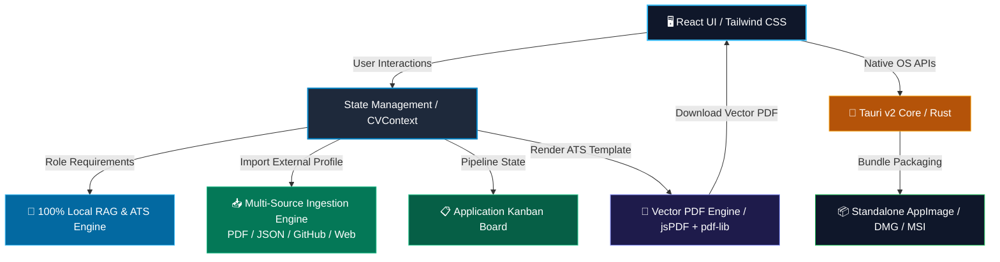

<div align="center">
    </img>
</div>

# CV Maker & Role Tracker 📄💼

[](https://choosealicense.com/licenses/mit/)
[](https://tauri.app/)
[](https://reactjs.org/)
[](https://www.typescriptlang.org/)
[](https://tailwindcss.com/)
[](https://www.rust-lang.org/)
[](https://www.docker.com/)
[](https://github.com/Veras-D/CV_Maker/actions)

---

A modern, high-performance desktop application and career management hub. Features an **Applicant Tracking System (ATS) compliant pure-vector PDF engine**, a **100% local client-side RAG & semantic role-tailoring suite**, a **multi-source profile ingestion engine**, a **drag-and-drop job application Kanban tracker**, and an **obsidian dark theme** built for speed and complete data privacy.

---

## ✨ Features

- 🎯 **100% Pure Vector PDF Engine**: Crisp vector text generation (`jsPDF` + `pdf-lib`) with embedded Dublin Core metadata, zero raster artifacts, and full ATS parseability.
- 🤖 **100% Local Semantic RAG & ATS Matcher**: Zero cloud API dependencies. Client-side BM25 inverted index, vector cosine term-frequency scoring, 2,500+ tech lexicon, and instant tailored cover letter synthesis.
- 📥 **Multi-Source Profile Ingestion**:
  - **File Upload**: Import & parse `.pdf`, `.txt`, `.md`, and `.json` CV files via drag-and-drop.
  - **GitHub Repos**: Scrapes public repositories, top languages, and bio directly.
  - **Portfolio / Web**: DOM readability extraction for personal websites.
  - **Resume Text**: Automatic section, skill, and contact detection.
- 📋 **Job Application Kanban Pipeline**: Visual application pipeline with native HTML5 drag-and-drop, custom dark calendar date picker, currency auto-masking, and permanent delete confirmation guards.
- 🌐 **Multi-Language Architecture**: Seamless document switching between English and Czech with centralized state synchronization.
- 🎨 **Obsidian Dark Design System**: High-density, keyboard-friendly UI with tailored color tokens, layered optical depth, and zero UI clutter.
- 🖥️ **Cross-Platform Desktop App**: Lightweight Rust backend powered by Tauri v2 with standalone Linux AppImage, macOS DMG, and Windows installer binaries.
- 🛡️ **5-Stage Automated Quality & Security Gate**: Strict cyclomatic complexity limits ($\le 12$), maximum function lines ($\le 150$), file limits ($\le 350$), strict zero-`any` enforcement, AST security checks (banned `dangerouslySetInnerHTML` / unsafe URLs), Gitleaks secret scanning, and clone detection ($\le 3\%$).

---

## 🛠️ Tech Stack

### Frontend & UI
- **Framework**: React 18 with TypeScript (Strict mode, zero `any`)
- **Styling**: Tailwind CSS with custom Obsidian Design System
- **PDF Generation**: jsPDF (Native Vector Drawing) + pdf-lib (Dublin Core Metadata Injection)
- **Local AI & RAG**: Native TypeScript BM25 index & TF-IDF vector cosine matching (<5ms latency)
- **Icons**: Lucide React
- **Build Tool**: Vite 5

### Desktop Backend
- **Core Engine**: Tauri v2
- **Language**: Rust (Edition 2021)
- **Packaging**: AppImage (`appimagetool`), DMG, MSI, NSIS

### DevOps & Automated Security
- **Quality Gates**: ESLint (`complexity`, `max-lines`, `max-lines-per-function`, `@typescript-eslint/no-explicit-any`), `jscpd` (Copy/Paste Detector)
- **Security Scanners**: **Gitleaks** (secret/credential scanning) + React AST security linters
- **Containerization**: Multi-stage Docker build for zero-host-dependency binary packaging
- **CI/CD**: GitHub Actions (5-Stage Quality & Security Gate + Multi-Platform Release Matrix)

---

## 🏗️ Architecture



---

## 📁 Project Structure

```bash
CV_Maker/
├── .github/
│   └── workflows/
│       ├── quality-gate.yml      # Automated 5-stage Quality & Security Gate CI
│       └── release.yml           # Multi-platform Linux/macOS/Windows release CI
├── src/
│   ├── components/
│   │   ├── AIFeatures/           # AI Role Tailor, ATS Scorecard & Multi-Source Ingestion
│   │   │   ├── AIIngestionModal.tsx
│   │   │   ├── AIRoleTailor.tsx
│   │   │   ├── AIRoleTailorHeader.tsx
│   │   │   ├── ATSScoreCard.tsx
│   │   │   ├── IngestionSourceTabs.tsx
│   │   │   ├── IngestionTabPanels.tsx
│   │   │   ├── TailoredOutputView.tsx
│   │   │   └── VacancyDetailsForm.tsx
│   │   ├── Common/               # CustomSelect, CustomDatePicker, CustomCurrencyInput, ProModal
│   │   │   ├── CustomCurrencyInput.tsx
│   │   │   ├── CustomDatePicker.tsx
│   │   │   ├── CustomSelect.tsx
│   │   │   ├── DatePickerCalendarDropdown.tsx
│   │   │   └── ProModal.tsx
│   │   ├── CVEditor/             # Modularized Resume Section Editors
│   │   │   ├── BulletListEditor.tsx
│   │   │   ├── CVEditor.tsx
│   │   │   ├── EducationSection.tsx
│   │   │   ├── ExperienceEditor.tsx
│   │   │   ├── ExperienceItemCard.tsx
│   │   │   ├── LanguagesSection.tsx
│   │   │   ├── ProfileContactInputs.tsx
│   │   │   ├── ProfileEditor.tsx
│   │   │   ├── ProjectsEducationEditor.tsx
│   │   │   ├── ProjectsSection.tsx
│   │   │   ├── SkillCategoryCard.tsx
│   │   │   └── SkillsEditor.tsx
│   │   ├── CVPreview/            # Classic ATS Resume preview template
│   │   │   ├── CVPreview.tsx
│   │   │   └── ClassicTemplate.tsx
│   │   ├── Kanban/               # Drag-and-drop application pipeline board
│   │   │   ├── ActiveColumn.tsx
│   │   │   ├── ArchivedColumn.tsx
│   │   │   ├── DeleteConfirmationModal.tsx
│   │   │   ├── KanbanBoard.tsx
│   │   │   ├── KanbanCardItem.tsx
│   │   │   ├── KanbanColumn.tsx
│   │   │   ├── KanbanHeader.tsx
│   │   │   ├── KanbanRoleFormFields.tsx
│   │   │   └── KanbanRoleModal.tsx
│   │   ├── Navbar.tsx            # Global navigation & PDF export triggers
│   │   ├── NavWorkspaceTabs.tsx  # Top-level workspace tab switcher
│   │   └── MetadataEditor.tsx    # Dublin Core PDF metadata editor
│   ├── context/
│   │   ├── CVContext.tsx         # Central React Context state provider
│   │   └── cvStateUpdaters.ts    # Pure state updaters & persistence logic
│   ├── types/
│   │   └── cv.ts                 # TypeScript data contracts & interfaces
│   ├── utils/
│   │   ├── aiService.ts          # Baseline AI interface types
│   │   ├── ingestionService.ts   # Multi-source scraper (Files, GitHub, Web, Text)
│   │   ├── localAiEngine.ts      # 100% local cover letter & summary synthesis
│   │   ├── pdfDrawSections.ts    # Modularized jsPDF canvas section drawers
│   │   ├── pdfExport.ts          # Pure vector PDF export orchestrator
│   │   ├── pdfMetadata.ts        # pdf-lib Dublin Core / XMP metadata injector
│   │   ├── semanticSearch.ts     # Client-side BM25 & cosine vector search engine
│   │   └── urlHelper.ts          # Desktop WebView safe external URL handler
│   ├── App.tsx                   # Main layout container
│   ├── main.tsx                  # React DOM entry point
│   └── index.css                 # Obsidian dark theme layers & styles
├── src-tauri/
│   ├── src/
│   │   └── main.rs               # Tauri Rust application entry point
│   ├── Cargo.toml                # Rust dependencies & metadata
│   └── tauri.conf.json           # Window & bundle configuration
├── .eslintrc.json                # Strict linting, complexity & security rules
├── .jscpd.json                   # Copy/paste clone detection configuration
├── build_app.sh                  # Internal Docker AppImage packaging script
├── build_desktop_docker.sh       # Zero-dependency host build script
├── DESIGN_GUIDE.md               # Visual design system specifications
└── package.json                  # Dependencies & automated quality scripts
```

---

## 🚀 Getting Started

### Prerequisites
- [Docker](https://www.docker.com/) (for zero-dependency desktop packaging)
- [Node.js 20+](https://nodejs.org/) & [Rust](https://www.rust-lang.org/) (for local development)

### 1. Build Standalone Linux Desktop App (Docker)
Build a standalone `.AppImage` with zero host library dependencies:

```bash
chmod +x ./build_desktop_docker.sh
./build_desktop_docker.sh
```

The script automatically cleans previous test caches and generates the executable in the root folder:
```bash
./CV_Maker_1.0.0_amd64.AppImage
```

---

### 2. Local Web Development

```bash
# Install dependencies
npm install

# Run Vite dev server
npm run dev
```
Open [http://localhost:5173](http://localhost:5173) in your browser.

---

### 3. Automated Code Quality & Security Gates

The repository enforces a strict **5-Stage Quality & Security Gate** on every commit and pull request:

```bash
# Run all quality checks locally (Typecheck + Lint/Security + Duplication)
npm run quality:check

# Individual verification commands:
npm run typecheck            # Gate 1: TypeScript strict compiler check
npm run lint                 # Gate 2: ESLint (complexity <= 12, max-lines <= 350, security rules)
npm run quality:duplication  # Gate 3: Clone & copy/paste detector (jscpd <= 3%)
npm run build                # Gate 5: Production build bundle verification
```

---

## 🤝 Contributing

Contributions are welcome! Follow these steps to contribute to the project:

### 1. Pick or Create an Issue
- Browse existing [Issues](https://github.com/Veras-D/CV_Maker/issues) or create a new one.
- Comment on the issue to let others know you're working on it.
- Wait for approval from maintainers before starting work.

### 2. Fork and Clone
```bash
git clone git@github.com:YOUR_USERNAME/CV_Maker.git
cd CV_Maker
```

### 3. Setup Development Environment
```bash
npm install
```

### 4. Create a Feature Branch
```bash
git checkout -b feature/issue-number-short-description
```

**Branch naming convention:**
- `feature/123-add-custom-export` for new features
- `fix/456-pdf-alignment` for bug fixes
- `docs/789-update-readme` for documentation
- `refactor/101-improve-kanban` for refactoring

### 5. Develop Your Changes
- Write clean, maintainable code following [DESIGN_GUIDE.md](DESIGN_GUIDE.md).
- Keep cyclomatic complexity $\le 12$ and function size $\le 150$ lines.
- Ensure all quality and security gates pass:
  ```bash
  npm run quality:check
  ```

### 6. Commit Your Changes
Use [Conventional Commits](https://www.conventionalcommits.org/) format:

```bash
git commit -m "feat: add localized export preset"
git commit -m "fix: resolve date picker popover alignment"
git commit -m "docs: update architecture diagram in README"
```

### 7. Push and Create Pull Request
```bash
git push origin feature/issue-number-short-description
```

---

## ☕ Support

If you find this project helpful, consider supporting the author:

[](https://ko-fi.com/verivi)

---

## 📄 License

This project is licensed under the [MIT License](LICENSE).
