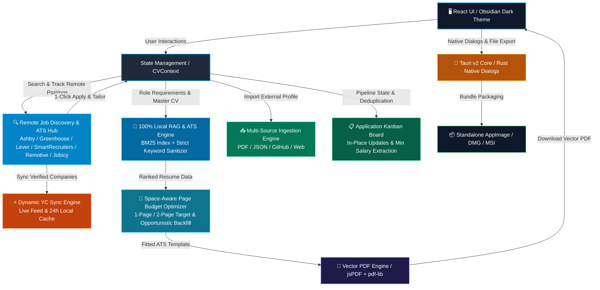

<div align="center">
    </img>
</div>

# CV Maker & Role Tracker 📄💼

[](https://choosealicense.com/licenses/mit/)
[](https://tauri.app/)
[](https://reactjs.org/)
[](https://www.typescriptlang.org/)
[](https://tailwindcss.com/)
[](https://vitest.dev/)
[](https://www.rust-lang.org/)
[](https://www.docker.com/)
[](https://github.com/Veras-D/CV_Maker/actions)

---

A modern, high-performance desktop application and career management hub. Features an **Applicant Tracking System (ATS) compliant pure-vector PDF engine**, a **space-aware CV page budget optimizer (1-page & 2-page targets with opportunistic backfill)**, a **live multi-source Remote Job Discovery & ATS Search engine with dynamic Y Combinator directory synchronization**, a **100% local client-side RAG & semantic role-tailoring suite**, a **multi-source profile ingestion engine**, a **drag-and-drop job application Kanban tracker with automated salary extraction**, and an **obsidian dark theme** built for speed and complete data privacy.

---

## ✨ Features

- 🔍 **Live Remote Job Discovery & Multi-ATS Hub**:
  - **Multi-Source Aggregation**: Direct live integration with public APIs and ATS platforms: **AshbyHQ**, **Greenhouse**, **Lever**, **SmartRecruiters**, **Remotive**, and **Jobicy**.
  - **Dynamic Live Y Combinator Synchronization**: Real-time integration with the official YC live hiring directory (`yc-oss.github.io`). Automatically parses and highlights verified YC startups with reactive badges across search results and active watchlists (with 24-hour local caching and legal entity normalization).
  - **Tracked Companies Watchlist & Autocomplete**: Custom company tracking drawer featuring multi-candidate ATS slug probing (detects Greenhouse, Lever, Ashby, and SmartRecruiters board variants simultaneously), direct URL ingestion, and pre-configured contracting/talent networks (Testlio, Turing, DistantJob, Andela, Braintrust, etc.).
  - **Visited Role UX & 3-State Visual Cards**: Tracks visited job cards locally (`cv_maker_clicked_jobs_v1`). Renders three distinct visual states at rest and on hover: *Unviewed* (prominent active card with sky highlight), *Viewed* (distinctly subdued 65% opacity card that stays dimmed on hover), and *Applied* (emerald border, tint, and hover accents). Includes a `"Hide already clicked"` filter with live hidden count badges.
  - **Slide-Over Drawer Job Details**: Right-side slide-over drawer modal with rich description rendering, key meta attributes, external application link launchers, and background page scroll locking.
  - **Contract & Freelance Duration Engine**: Specialized duration filtering (`1 Month / Short-term`, `1–3 Months`, `3–6 Months`, `6+ Months`, and `Part-Time`) via smart title and description regex parsing.
  - **1-Click "Apply & Tailor" Workflow**: Opens the official job listing in your browser, registers the application in Kanban under `applied`, extracts minimum salary from salary ranges, and switches directly to the AI Tailor tab pre-filled for immediate ATS resume keyword matching and English cover letter synthesis.
  - **Google ATS Search Shortcut**: 1-click launcher generating optimized boolean queries across ATS boards (`site:jobs.ashbyhq.com OR site:job-boards.greenhouse.io OR site:jobs.lever.co OR site:jobs.smartrecruiters.com ...`).
  - **Responsive Page-by-Page Pagination**: Clean 12-item paginated grid with status indicator (`Showing X to Y of Z jobs`), dynamic page numbers with ellipsis, and smooth scroll-to-top.

- 📐 **Space-Aware CV Page Budget Optimizer**:
  - **Strict 1-Page & 2-Page Target Budgeting**: Calculates the exact physical millimeter height of the rendered PDF layout (`USABLE_PAGE_HEIGHT_MM = 260mm`) matching native jsPDF text-wrapping and section geometry.
  - **Career Preservation Rule (Top 4 Roles Protected)**: The candidate's top 4 active work experiences are 100% immune from omission. If a candidate has $\le 4$ roles, no roles are ever dropped, preserving complete career chronology.
  - **Progressive Bullet Compression**: Compresses bullet points to a clean minimum of 2 bullets per role before pruning secondary projects, education, or sparse skill categories.
  - **Opportunistic Whitespace Backfill**: Once the CV safely fits within the target page limit, the optimizer greedily backfills high-relevance projects, bullets, education, and skills in reverse order to maximize information density without spilling onto an accidental extra page.
  - **Compaction Audit Banner**: Interactive banner in the preview workspace displaying original vs. optimized height in millimeters, target page budget, and compaction notes.

- 🤖 **100% Local Semantic RAG & ATS Matcher**:
  - **Zero Cloud API Dependencies**: Completely client-side BM25 inverted index and vector cosine term-frequency scoring (<5ms latency).
  - **Strict Technical Keyword Validation**: Dedicated `isValidKeyword()` filter that strictly rejects pure numbers (`11`, `70`, `2023`), numeric suffixes (`1st`, `10k`), stop words (`about`), and non-technical corporate vocabulary (`team`, `work`, `years`, `company`, `iconiq`).
  - **Mutually Exclusive Keyword Partitioning**: Guarantees 0% overlap between **"Matched Skills & Keywords"** (verified skills present in candidate's CV) and **"Job Keywords to Consider Adding"** (job requirements the candidate lacks).
  - **14 Pre-Seeded Career Domains & Self-Learning Graph**: Out-of-the-box knowledge base across Frontend, Backend, DevOps, Data/AI, Security, Testing/QA, Mobile, Fintech, etc., with automatic cache auto-sanitization on launch.
  - **Executive Summary Synthesis Upgrades**: Synthesizes grounded executive profiles using clean job title extraction, career tenure calculation, candidate skill grounding, and 3 distinct style archetypes (*Authentic*, *Technical*, *Impact*) in both English and Czech.
  - **Dynamic Cover Letter Synthesis**: English-only natural narrative cover letter generator with selectable tones (*Confident*, *Technical*, *Balanced*).

- 📋 **Job Application Kanban Pipeline**:
  - **Automated Salary Extraction**: Automatically parses minimum salary values from salary ranges (e.g., `"$115,600 - $170,000 / yr"` $\rightarrow$ `115,600 USD / yr`) across USD, EUR, GBP, and CZK on application cards and during 1-click tailoring.
  - **In-Place Updates with Field Preservation**: Enforces URL uniqueness. When re-applying or pasting an existing link, updates company/title/salary in place while strictly preserving existing pipeline stage (`status`), `notes`, and original `dateApplied`.
  - **Visual Pipeline Controls**: Native HTML5 drag-and-drop, custom dark calendar date picker, inactive card warning indicators (>14 days), title search with auto-reveal, and collapsible 'Applied' column toggle.

- 🎯 **100% Pure Vector PDF Engine**: Crisp vector text generation (`jsPDF` + `pdf-lib`) with embedded Dublin Core metadata, zero raster artifacts, and full ATS parseability.
- 📥 **Multi-Source Profile Ingestion**: Import & parse `.pdf`, `.txt`, `.md`, and `.json` CV files, scrape public GitHub repositories, and extract personal website readability DOM text.
- ⚙️ **Settings & Native OS Integration**: Native OS directory picker for Tauri (`zenity`/`kdialog`, PowerShell `FolderBrowserDialog`, macOS `osascript`) and modern web fallback, unified `h-9` CustomSelect dropdowns, and custom PDF export directory routing.
- 🔒 **Modal Scroll Lock**: Reference-counted body scroll locking (`useBodyScrollLock`) preventing background page scrolling and layout shift across all 6 dialog modals.
- 🎨 **Obsidian Dark Design System**: High-density, keyboard-friendly UI with tailored color tokens, layered optical depth, and zero UI clutter.
- 🖥️ **Cross-Platform Desktop App**: Lightweight Rust backend powered by Tauri v2 with standalone Linux AppImage, macOS DMG, and Windows installer binaries.
- 🛡️ **7-Stage Automated Quality & Security Gate**: Strict cyclomatic complexity limits ($\le 12$), maximum function lines ($\le 150$), file limits ($\le 350$), strict zero-`any` enforcement, AST security checks, automated Vitest unit testing suite (99 passing tests), Gitleaks secret scanning, and clone detection ($\le 3\%$).

---

## 🛠️ Tech Stack

### Frontend & UI
- **Framework**: React 18 with TypeScript (Strict mode, zero `any`)
- **Styling**: Tailwind CSS with custom Obsidian Design System
- **Unit Testing**: Vitest 5.0 + Happy-DOM (99 tests across 10 suites)
- **Job Discovery & Aggregation**: Ashby, Greenhouse, Lever, SmartRecruiters, Remotive, and Jobicy public REST APIs
- **Live Feeds**: Dynamic YC hiring directory sync engine (`dynamicYcService`)
- **Layout Budgeting**: Custom mm-precision jsPDF layout estimator & opportunistic backfill engine (`cvPageBudgetOptimizer`)
- **PDF Generation**: jsPDF (Native Vector Drawing) + pdf-lib (Dublin Core Metadata Injection)
- **Local AI & RAG**: Native TypeScript BM25 index & TF-IDF vector cosine matching (<5ms latency)
- **Icons**: Lucide React
- **Build Tool**: Vite 6

### Desktop Backend
- **Core Engine**: Tauri v2
- **Language**: Rust (Edition 2021)
- **Native OS Dialogs**: `pick_directory` (Linux `zenity`/`kdialog`, Windows PowerShell, macOS `osascript`), `save_file_to_directory`
- **Packaging**: AppImage (`appimagetool`), DMG, MSI, NSIS

### DevOps & Automated Security
- **Quality Gates**: ESLint (`complexity`, `max-lines`, `max-lines-per-function`, `@typescript-eslint/no-explicit-any`), `jscpd` (Copy/Paste Detector)
- **Test Gate**: Vitest automated unit test runner (`npm run test:run`)
- **Security Scanners**: **Gitleaks** (secret/credential scanning) + React AST security linters
- **Containerization**: Multi-stage Docker build for zero-host-dependency binary packaging
- **CI/CD**: GitHub Actions (7-Stage Quality & Security Gate + Multi-Platform Release Matrix with auto-publishing)

---

## 🏗️ Architecture


```mermaid
graph TD
    Client[🖥️ React UI / Obsidian Dark Theme]
    Context[State Management / CVContext]
    JobDiscovery[🔍 Remote Job Discovery & ATS Hub\nAshby / Greenhouse / Lever / SmartRecruiters / Remotive / Jobicy]
    DynamicYC[⚡ Dynamic YC Sync Engine\nLive Feed & 24h Local Cache]
    LocalRAG[🤖 100% Local RAG & ATS Engine\nBM25 Index + Strict Keyword Sanitizer]
    PageBudget[📐 Space-Aware Page Budget Optimizer\n1-Page / 2-Page Target & Opportunistic Backfill]
    Ingestion[📥 Multi-Source Ingestion Engine\nPDF / JSON / GitHub / Web]
    Kanban[📋 Application Kanban Board\nIn-Place Updates & Min Salary Extraction]
    PDFEngine[📄 Vector PDF Engine / jsPDF + pdf-lib]
    RustBackend[🦀 Tauri v2 Core / Rust Native Dialogs]
    DesktopBinary[📦 Standalone AppImage / DMG / MSI]

    Client -->|User Interactions| Context
    Context -->|Search & Track Remote Postings| JobDiscovery
    JobDiscovery -->|Sync Verified Companies| DynamicYC
    JobDiscovery -->|1-Click Apply & Tailor| Context
    Context -->|Role Requirements & Master CV| LocalRAG
    LocalRAG -->|Ranked Resume Data| PageBudget
    Context -->|Import External Profile| Ingestion
    Context -->|Pipeline State & Deduplication| Kanban
    PageBudget -->|Fitted ATS Template| PDFEngine
    Client -->|Native Dialogs & File Export| RustBackend
    RustBackend -->|Bundle Packaging| DesktopBinary
    PDFEngine -->|Download Vector PDF| Client

    style Client fill:#0f172a,stroke:#38bdf8,stroke-width:2px,color:#fff
    style Context fill:#1e293b,stroke:#0284c7,stroke-width:2px,color:#fff
    style JobDiscovery fill:#0284c7,stroke:#38bdf8,color:#fff
    style DynamicYC fill:#c2410c,stroke:#f97316,color:#fff
    style LocalRAG fill:#0369a1,stroke:#38bdf8,color:#fff
    style PageBudget fill:#0e7490,stroke:#22d3ee,color:#fff
    style Ingestion fill:#047857,stroke:#10b981,color:#fff
    style Kanban fill:#065f46,stroke:#34d399,color:#fff
    style PDFEngine fill:#1e1b4b,stroke:#818cf8,color:#fff
    style RustBackend fill:#b45309,stroke:#f59e0b,color:#fff
    style DesktopBinary fill:#0f172a,stroke:#22c55e,color:#fff
```

---

## 📁 Project Structure

```bash
CV_Maker/
├── .github/
│   └── workflows/
│       ├── quality-gate.yml         # Automated 7-stage Quality & Security Gate CI
│       └── release.yml              # Multi-platform Linux/macOS/Windows release CI (Auto-publish latest)
├── src/
│   ├── components/
│   │   ├── AIFeatures/              # AI Role Tailor, ATS Scorecard, Auto-Apply & Multi-Source Ingestion
│   │   │   ├── AIIngestionModal.tsx
│   │   │   ├── AIRoleTailor.tsx
│   │   │   ├── AIRoleTailorHeader.tsx
│   │   │   ├── ATSScoreCard.tsx
│   │   │   ├── CoverLetterCard.tsx
│   │   │   ├── CoverLetterToneSelector.tsx
│   │   │   ├── IngestionSourceTabs.tsx
│   │   │   ├── IngestionTabPanels.tsx
│   │   │   ├── PageBudgetAuditBanner.tsx
│   │   │   ├── SummaryStyleSelector.tsx
│   │   │   ├── TailoredOutputView.tsx
│   │   │   ├── TailoredSummaryCard.tsx
│   │   │   ├── tailorExportHelpers.ts
│   │   │   ├── useAIRoleTailorState.ts
│   │   │   ├── useTailorAutoApply.ts
│   │   │   └── VacancyDetailsForm.tsx
│   │   ├── Common/                  # CustomSelect, CustomDatePicker, CustomCurrencyInput, ProModal
│   │   │   ├── CustomCurrencyInput.tsx
│   │   │   ├── CustomDatePicker.tsx
│   │   │   ├── CustomSelect.tsx
│   │   │   ├── DatePickerCalendarDropdown.tsx
│   │   │   └── ProModal.tsx
│   │   ├── CVEditor/                # Modularized Resume Section Editors
│   │   │   ├── BulletListEditor.tsx
│   │   │   ├── CVEditor.tsx
│   │   │   ├── EducationSection.tsx
│   │   │   ├── ExperienceEditor.tsx
│   │   │   ├── ExperienceItemCard.tsx
│   │   │   ├── LanguagesSection.tsx
│   │   │   ├── ProfileContactInputs.tsx
│   │   │   ├── ProfileEditor.tsx
│   │   │   ├── ProjectsEducationEditor.tsx
│   │   │   ├── ProjectsSection.tsx
│   │   │   ├── SkillCategoryCard.tsx
│   │   │   └── SkillsEditor.tsx
│   │   ├── CVPreview/               # Classic ATS Resume preview template
│   │   │   ├── CVPreview.tsx
│   │   │   └── ClassicTemplate.tsx
│   │   ├── JobSearch/               # Live Remote Job Discovery, ATS Aggregation & Watchlist
│   │   │   ├── CompanySearchAutocomplete.tsx
│   │   │   ├── JobCard.tsx
│   │   │   ├── JobCardBadges.tsx
│   │   │   ├── JobCardFooter.tsx
│   │   │   ├── JobDetailModal.tsx
│   │   │   ├── JobFilterControlsRow.tsx
│   │   │   ├── JobPagination.tsx
│   │   │   ├── JobSearchBar.tsx
│   │   │   ├── JobSearchDropdown.tsx
│   │   │   ├── JobSearchFilters.tsx
│   │   │   ├── JobSearchTab.tsx
│   │   │   ├── JobSourceCheckboxes.tsx
│   │   │   ├── TrackedCompaniesModal.tsx
│   │   │   └── useJobSearchData.ts
│   │   ├── Kanban/                  # Drag-and-drop application pipeline board
│   │   │   ├── ActiveColumn.tsx
│   │   │   ├── ArchivedColumn.tsx
│   │   │   ├── DeleteConfirmationModal.tsx
│   │   │   ├── KanbanBoard.tsx
│   │   │   ├── KanbanCardItem.tsx
│   │   │   ├── KanbanColumn.tsx
│   │   │   ├── KanbanHeader.tsx
│   │   │   ├── KanbanRoleFormFields.tsx
│   │   │   └── KanbanRoleModal.tsx
│   │   ├── Settings/                # Application preferences & PDF layout settings
│   │   │   └── LayoutSettingsCard.tsx
│   │   ├── Navbar.tsx               # Global navigation & PDF export triggers
│   │   ├── NavWorkspaceTabs.tsx     # Top-level workspace tab switcher
│   │   └── MetadataEditor.tsx       # Dublin Core PDF metadata editor
│   ├── context/
│   │   ├── CVContext.tsx            # Central React Context state provider & 1-click apply handler
│   │   └── cvStateUpdaters.ts       # Pure state updaters & persistence logic
│   ├── types/
│   │   ├── cv.ts                    # Resume, Kanban & Profile TypeScript contracts
│   │   └── jobSearch.ts             # JobSearch, sources, contract duration & filter contracts
│   ├── utils/
│   │   ├── aiService.ts             # Baseline AI interface types
│   │   ├── clickedJobsService.ts    # Visited job card persistence & count tracker
│   │   ├── companyWatchlistService.ts # Custom tracked companies & ATS slug auto-detection
│   │   ├── coverLetterSynthesizer.ts# Dynamic narrative English cover letter synthesis
│   │   ├── cvPageBudgetOptimizer.ts # Space-aware 1-page/2-page layout budget optimizer
│   │   ├── cvSectionOptimizers.ts   # Experience protection, bullet compaction & backfill
│   │   ├── dynamicYcService.ts      # Live Y Combinator hiring directory synchronizer
│   │   ├── editorLimits.ts          # Character limits & collection caps for CV Editor
│   │   ├── ingestionService.ts      # Multi-source scraper (Files, GitHub, Web, Text)
│   │   ├── jobFilterEngine.ts       # Strict remote detector, contract duration & region classifiers
│   │   ├── jobSearchAggregators.ts  # Remotive, Jobicy & SmartRecruiters REST fetchers
│   │   ├── jobSearchApi.ts          # Multi-ATS fetch orchestrator & Google search query builder
│   │   ├── jobSuggestionEngine.ts   # Hybrid role, company & tech taxonomy search suggestion engine
│   │   ├── kanbanUtils.ts           # Minimum salary extraction, deduplication & Kanban helpers
│   │   ├── knowledgeBaseSeeds.ts    # 14 career domain seeds for local RAG
│   │   ├── knowledgeGraph.ts        # Self-learning dynamic knowledge graph & auto-sanitization
│   │   ├── localAiEngine.ts         # 100% local cover letter & summary synthesis orchestrator
│   │   ├── pdfDrawSections.ts       # Modularized jsPDF canvas section drawers
│   │   ├── pdfExport.ts             # Pure vector PDF export orchestrator
│   │   ├── pdfLayoutEstimator.ts    # Physical mm height estimation matching jsPDF text wrap
│   │   ├── pdfMetadata.ts           # pdf-lib Dublin Core / XMP metadata injector
│   │   ├── semanticSearch.ts        # Client-side BM25 & cosine vector search engine
│   │   ├── summarySynthesizer.ts    # Grounded executive profile synthesis with 3 archetypes
│   │   ├── tauriFileExport.ts       # Native OS directory picker & filesystem save handler
│   │   ├── textProcessing.ts        # Tokenizer, stop words & strict keyword validation
│   │   ├── urlHelper.ts             # Desktop WebView safe external URL handler
│   │   └── useBodyScrollLock.ts     # Reference-counted modal background scroll lock
│   ├── App.tsx                      # Main layout container & tab routing
│   ├── main.tsx                     # React DOM entry point
│   └── index.css                    # Obsidian dark theme layers & styles
├── src-tauri/
│   ├── src/
│   │   └── main.rs                  # Tauri Rust application entry point (native dialogs & file IO)
│   ├── Cargo.toml                   # Rust dependencies & metadata
│   └── tauri.conf.json              # Window & bundle configuration
├── .eslintrc.json                   # Strict linting, complexity & security rules
├── .jscpd.json                      # Copy/paste clone detection configuration
├── vitest.config.ts                 # Vitest test runner configuration
├── build_app.sh                     # Internal Docker AppImage packaging script
├── build_desktop_docker.sh          # Zero-dependency host build script
├── DESIGN_GUIDE.md                  # Visual design system specifications
└── package.json                     # Dependencies & automated quality scripts
```

---

## 🚀 Getting Started

### Prerequisites
- [Docker](https://www.docker.com/) (for zero-dependency desktop packaging)
- [Node.js 20+](https://nodejs.org/) & [Rust](https://www.rust-lang.org/) (for local development)

### 1. Build Standalone Linux Desktop App (Docker)
Build a standalone `.AppImage` with zero host library dependencies:

```bash
chmod +x ./build_desktop_docker.sh
./build_desktop_docker.sh
```

The script automatically cleans previous test caches and generates the executable in the root folder:
```bash
./CV_Maker_1.5.0_amd64.AppImage
```

---

### 2. Local Web Development

```bash
# Install dependencies
npm install

# Run Vite dev server
npm run dev
```
Open [http://localhost:5173](http://localhost:5173) in your browser.

---

### 3. Automated Code Quality & Security Gates

The repository enforces a strict **7-Stage Quality & Security Gate** on every commit and pull request:

```bash
# Run all quality & security checks locally
npm run quality:check

# Individual verification commands:
npm run typecheck            # Gate 1: TypeScript strict compiler check
npm run lint                 # Gate 2: Static Analysis & Complexity (ESLint <= 12, max-lines <= 350)
npm run quality:duplication  # Gate 3: Clone & copy/paste detector (jscpd <= 3%)
npm run test:run             # Gate 4: Automated Unit Tests (Vitest - 99 tests passing)
npm run quality:audit        # Gate 5: Security Gate - Dependency Vulnerability Audit
npm run build                # Gate 6: Production build bundle verification
```
*(Gate 7: Automated Gitleaks secret and credential scanning runs during GitHub Actions CI)*

---

## 🤝 Contributing

Contributions are welcome! Follow these steps to contribute to the project:

### 1. Pick or Create an Issue
- Browse existing [Issues](https://github.com/Veras-D/CV_Maker/issues) or create a new one.
- Comment on the issue to let others know you're working on it.
- Wait for approval from maintainers before starting work.

### 2. Fork and Clone
```bash
git clone git@github.com:YOUR_USERNAME/CV_Maker.git
cd CV_Maker
```

### 3. Setup Development Environment
```bash
npm install
```

### 4. Create a Feature Branch
```bash
git checkout -b feature/issue-number-short-description
```

**Branch naming convention:**
- `feature/123-add-custom-export` for new features
- `fix/456-pdf-alignment` for bug fixes
- `docs/789-update-readme` for documentation
- `refactor/101-improve-kanban` for refactoring

### 5. Develop Your Changes
- Write clean, maintainable code following [DESIGN_GUIDE.md](DESIGN_GUIDE.md).
- Keep cyclomatic complexity $\le 12$ and function size $\le 150$ lines.
- Ensure all quality and security gates pass:
  ```bash
  npm run quality:check
  ```

### 6. Commit Your Changes
Use [Conventional Commits](https://www.conventionalcommits.org/) format:

```bash
git commit -m "feat: add localized export preset"
git commit -m "fix: resolve date picker popover alignment"
git commit -m "docs: update architecture diagram in README"
```

### 7. Push and Create Pull Request
```bash
git push origin feature/issue-number-short-description
```

---

## ☕ Support

If you find this project helpful, consider supporting the author:

[](https://ko-fi.com/verivi)

---

## 📄 License

This project is licensed under the [MIT License](LICENSE).
